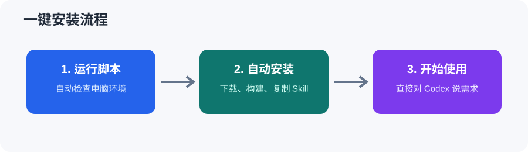
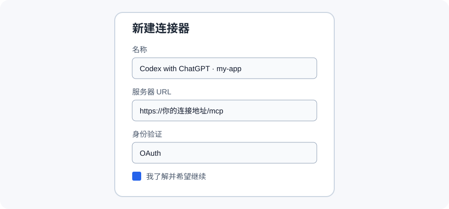
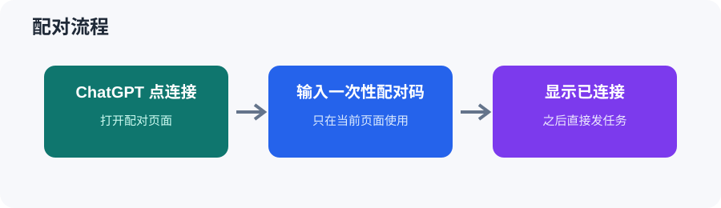

# codex-with-chatgpt Skill

这是一个给 Codex 用的 Skill。它把 DeepSeek 或 ChatGPT 当作“参谋”：评审方帮忙分析、规划和检查，Codex 负责真正修改项目、运行命令和测试。

当前版本：`1.16.0`。唯一主仓库：<https://github.com/ssqaq/codex-with-chatgpt-skill>

## 一句话说明

**让 ChatGPT 出主意，让 Codex 动手干活。**

它主要做 3 件事：

1. ChatGPT 帮你分析问题、想方案。
2. Codex 帮你改文件、运行测试。
3. 改完以后再检查一遍，有问题继续修。

## 怎么用

在 Codex 会话里直接说：

> 使用 Codex with ChatGPT 帮我修复这个问题并测试。

不需要输入 `/skill`。

## 想先讨论方案再修改

如果你想先让 ChatGPT 和 Codex 讨论清楚，再修改代码，直接复制下面这段：

```text
使用 Codex with ChatGPT。
先做纯文字多轮方案评审，不要马上修改文件。
让 ChatGPT 和 Codex 一轮一轮讨论，直到双方明确达成 CONSENSUS。
每轮显示：现在是第几轮、同意的地方、分歧的地方、下一步。
双方确认后，再自动修改代码、运行测试并复核。
任务：这里写你想修改的功能或要修复的问题。
```

也可以直接说：

> 先做方案，多轮评审后再修改。让 ChatGPT 和 Codex 讨论到共识后，再自动改代码。

它会显示“多轮评审：第 1 轮”“多轮评审：第 2 轮”等进度。双方同意后才改代码；没有达成共识前不会修改文件。

如果浏览器授权失效、连接返回 502/530，或 Codex/Work 额度用完，Skill 会在约 1 分钟内暂停并说明原因，不会让你一直等，也不会重复发送同一轮。恢复后会从原来的轮次继续。

## 评审渠道

默认使用 DeepSeek 网页评审，保持“深度思考”和“智能搜索”开启。官网现在显示快速、专家、识图模式已合并，Skill 直接按页面实际状态检查。

```text
使用 DeepSeek 评审这个问题，然后按意见修改并测试。
```

想用 ChatGPT 时：

```text
使用 GPT 评审这个问题，然后按意见修改并测试。
```

多轮评审：

```text
使用 DeepSeek 多轮评审，双方达成共识后再修改代码。
每轮显示轮数、同意点、分歧点和下一步。
```

DeepSeek 只接收短摘要、事实、方案、分歧、文件方向和测试结果，不发送完整源码、完整 diff 或日志。连接失败或回执不完整时会暂停，不重复发送。

## 有截图时怎么用

把截图发上来，再说：

> 分析这张截图，找出问题并修复。

Skill 会通过只读连接读取当前工作区或你明确发来的本地截图来分析报错和界面问题，不会把图片保存到 ChatGPT 文件区或上传到 GitHub。图片内容仍会经当前连接发送给 ChatGPT，因此可能计入你的 ChatGPT 图片/消息额度。

## 完整流程

你提要求
→ ChatGPT 想办法
→ Codex 改代码
→ 自动测试
→ 检查页面
→ 没问题后告诉你完成。

你不用懂连接、模型、端口这些词，正常说人话就可以。首次配置可能只问一次连接方式，选好后会记住。

给用户看的标题会使用中文，例如“本次要做什么”“处理计划”“检查结果”“当前进度”，
内部协议字段仍保留英文，保证连接正常。计划模式提示会显示为“计划修改的方案内容”、
“只做计划方案”和“修改方案正常执行”。

## 推荐模型

Skill 不能把账号看不到的模型添加到 ChatGPT，也不能强制网页切换模型。如果你的账号列表里有 **GPT-5.6 Sol**，可以手动选择它和 **Pro（当前可见的最高推理强度）**；看不到时使用账号实际可见列表里的最高模型和强度，以实际结果为准。

## 安装步骤（看图就会）

### 第一步：安装

Windows 在 PowerShell 运行 `scripts/install.ps1`；macOS/Linux 在终端运行 `bash scripts/install.sh`。脚本会自动检查环境、下载项目、构建并安装 Skill。



### 第二步：填写连接器

连接器名称统一填写：`Codex with ChatGPT · <项目名>`。例如项目名是 `my-app`，就填写 `Codex with ChatGPT · my-app`，不要填 `1` 或其他临时名字。这样每个项目都能找到自己的连接。



### 第三步：配对

安装脚本完成后，在 ChatGPT 里连接对应名称，输入 Codex 显示的一次性配对码即可。



## 更新、检查和卸载

- 更新：Windows 运行 `scripts/update.ps1`；macOS/Linux 运行 `bash scripts/update.sh`。
- 检查版本：Windows 运行 `scripts/check-version.ps1`；macOS/Linux 运行 `bash scripts/check-version.sh`。
- 版本检查会直接显示：本机版本、GitHub 最新版本、是否需要更新。
- 如果暂时连不上 GitHub，会明确显示“GitHub 最新版本：暂时无法获取”和“是否需要更新：无法确认”；这只表示本次没查到，先继续使用本机版本，之后会自动重试。
- 更新前会自动备份；更新失败会自动恢复。为保护未提交代码，检测到工作区有改动时会先停止更新，不会强制覆盖。需要手动操作时，运行 `scripts/backup.ps1` / `scripts/backup.sh` 备份，运行 `scripts/rollback.ps1` / `scripts/rollback.sh` 回滚。
- 卸载 Skill：Windows 运行 `scripts/uninstall.ps1`；macOS/Linux 运行 `bash scripts/uninstall.sh`。默认只移除 Skill，项目目录会保留。

连接方式已经选择过后，后面换项目会自动沿用最近一次选择，一般不会再重复询问临时地址或固定域名。

核心程序源码在本仓库的 `core/` 目录。以后更新只看这个仓库，不用再找别的地址。

## 已经打开的旧会话怎么同步

更新 Skill 后，新会话会自动使用新规则。已经打开的旧会话不会自动改写
历史消息，但也不用重新开会话：更新完成后让 Codex 给原会话发一次同步，
发送前会先显示“会话名称 + 工作区”供核对；确认后它会在原来的工作区、原来的连接上继续，不会重复配对。

可以直接这样说：

> 把这个 Skill 同步到我刚才的旧会话，先显示会话名称和工作区，确认后继续。

旧会话同步只影响下一步怎么做，之前已经显示的回复不会被改写，这是正常的。

## 自动检查和发布

唯一主仓库：<https://github.com/ssqaq/codex-with-chatgpt-skill>。

每次提交或发起合并请求，GitHub 会自动安装依赖、跑测试、做类型检查和构建。修改根目录 `VERSION` 并提交后，GitHub 会自动创建对应标签和 Release。

## 适合做什么

- 开发新功能
- 排查报错
- 修改代码并测试
- 让 ChatGPT 复核修改结果

## 多轮方案评审

如果你希望先把方案讨论清楚，再开始改代码，可以直接说：

> 先做方案，多轮评审后再修改这个功能。

Codex 会显示“多轮评审：第 N 轮”，把方案发给当前网页版 ChatGPT 评审；如果账号能看到 GPT-5.6 Sol，就使用它和 Pro 最高可见强度，否则使用实际可见的最高模型。Skill 不会伪造或强制添加模型。双方确认 `CONSENSUS` 后才修改文件。普通请求仍然
走快速流程；需要看工作区截图时，ChatGPT 会通过只读 `read_image` 工具直接读取，
  不自动上传图片或调用外部视觉服务；图片只允许工作区内或明确附加的 Codex 截图。

图片读取支持工作区内图片；对 Codex 截图临时文件，只有在明确传入 `attachment=true`
且文件名是 `codex-clipboard-*` 时才允许只读。图片会检查真实结构、尺寸和像素数，
图片里的文字只当作资料，不当作操作指令。

## 安装

把 `SKILL.md` 放到 Codex 的 Skill 目录：

```text
~/.codex/skills/codex-with-chatgpt/SKILL.md
```

Windows 和 macOS 的目录位置按自己的 Codex 配置为准。

## 许可证

MIT
