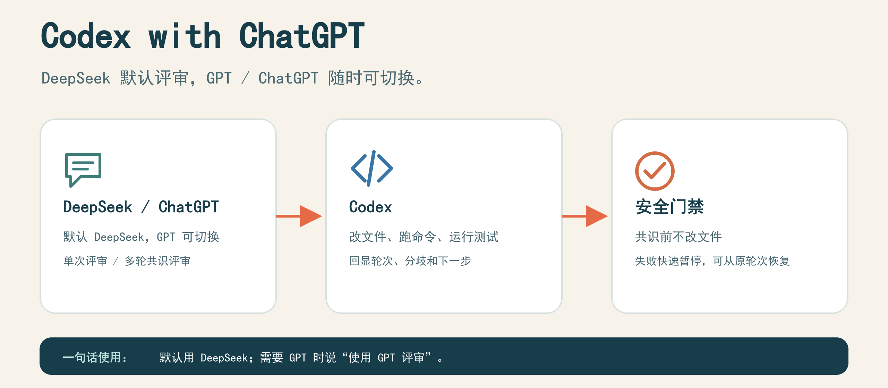
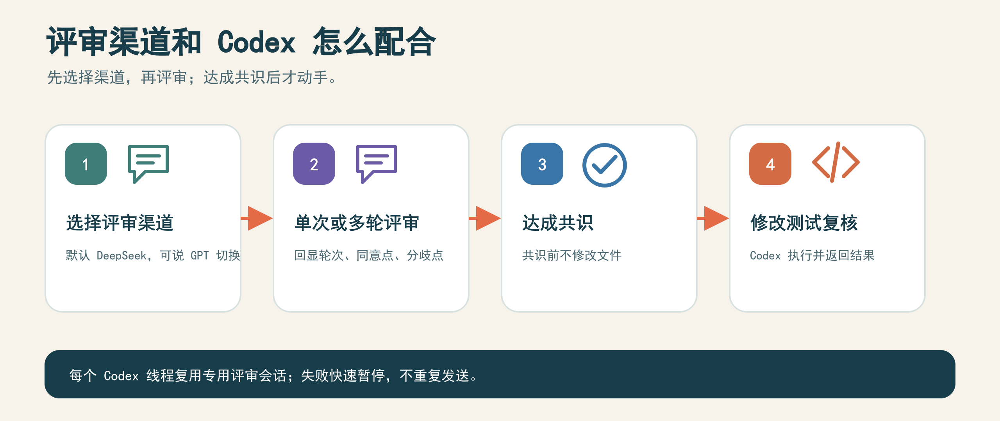
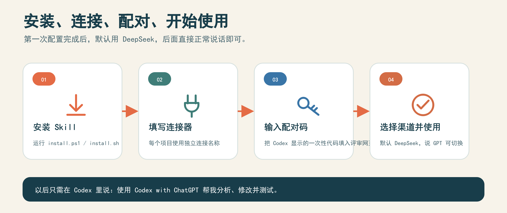

# codex-with-chatgpt Skill

当前版本：`1.19.2`

唯一仓库：<https://github.com/ssqaq/codex-with-chatgpt-skill>

## 这次主要修了什么

1. **新任务不会被旧恢复次数卡住**：每次新评审分别计数，复用原对话时保留旧审计。同一任务仍只自动恢复一次，避免无限重连。
2. **读到回复就往下做**：只读本轮回复，排除思考区和上一轮内容；短回复没有末尾提示也能识别结束。
3. **等待不再占着发送锁**：先确认消息确实发出，再等评审结果。锁过期时核对原消息补回执，不重新发一遍。
4. **告诉你慢在哪里**：记录发送、网页等待、Codex核对、恢复和实际修改的时间。每满一分钟显示当前轮次；没有记录就显示“未记录”。
5. **完成标准更严格**：双方先确认方案，Codex再真正改文件、测试、检查页面，最后再让评审方检查修改结果；不能只写“开始执行”就算完成。
6. **原对话确实找不回也有后续**：你允许后，会先确认原对话不存在，再新建并带上已确认的方案摘要。消息发送结果不明时先核对，不重复发一遍。
7. **补测真正的流程**：完成一组4轮和一组3轮方案评审，两组都实际修改、各跑23项测试、检查页面并做最终复核。核心395项测试通过；每轮耗时、工具延迟和测试范围见[测试记录](docs/verification/1.19.2.md)。

默认仍使用 **DeepSeek**，保持“深度思考”和“智能搜索”开启。明确说“用 GPT/ChatGPT”时才切换。网页生成速度由服务决定，Skill 不保证每轮固定几秒；5/15秒是页面检查目标，实际超时会记录。

第二组三轮方案共约5分8秒，没有重现第一轮一直卡住；但每5秒检查的目标仍未全部达标，不能说所有速度问题都已消除。

## 这个东西是干嘛的

说白了一句话：

**默认让 DeepSeek 出主意，让 Codex 动手干活。你说“用 GPT”，才换成 ChatGPT 出主意。**

它主要帮你做 3 件事：

1. 先让 DeepSeek（或你指定的 ChatGPT）帮你想：这个问题怎么修、功能怎么做。
2. 再让 Codex 真正去改文件、运行命令、跑测试。
3. 改完以后再自动检查一遍，有问题就继续修，没问题才告诉你完成了。

你不用懂什么连接、模型、端口，正常说人话就行。

  

## 一张图看懂它怎么干活

  

## 它有哪些功能

| 功能 | 大白话说明 |
|---|---|
| 默认用 DeepSeek | 不特别说明时，自动打开 DeepSeek 网页，保持“深度思考”和“智能搜索”开启 |
| 想用 GPT 才切换 | 你说“使用 GPT/ChatGPT 评审”，才走 ChatGPT 流程 |
| 单次 / 多轮评审 | 单次就是问一次拿意见；多轮就是来回讨论，每轮显示第几轮、同意什么、分歧什么 |
| 先整理再发送 | Codex 先把你的问题整理成干净摘要，再发给评审方，不会把原话或原图直接丢过去 |
| Codex 动手修改 | 在你的项目目录里真正改文件、运行命令、跑测试 |
| 不聊明白不动手 | 双方意见没达成一致前，不改你的文件；一致后才动手 |
| 改完再检查 | 修改后把测试结果交回评审方再核对一遍 |
| 截图辅助排查 | 截图先由 Codex 看懂并翻译成文字，再进入评审 |
| 不乱发你的代码 | 只发简短摘要、方案和测试结果，不发完整源码和完整日志 |
| 出问题会停下 | 连接失败、超时、额度不够时会停下来告诉你原因，不会一直转圈或重复发送 |
| 会话不串门 | 每个 Codex 会话用自己的评审对话和浏览器标签，不会串到别的会话 |

## 安装到开始使用

  

## 怎么使用

在 Codex 的对话框里直接说人话就可以，不需要输入 `/skill`。

普通用法（默认用 DeepSeek），直接说：

> 使用 Codex with ChatGPT 帮我修复这个问题并测试。

想先讨论方案、再改代码，就说：

> 先做方案，多轮评审后再修改。让 DeepSeek 和 Codex 讨论到共识后，再自动改代码。

## 多轮评审的真实流程（重点看这里）

很多人担心：我提出的问题带截图、描述啰嗦，会不会被原样丢给 DeepSeek，它完全看不懂？

不会。真实流程是这样的：

1. **你提出问题**：随便带截图、报错、一大段啰嗦描述都可以。
2. **Codex 先自己消化**：看截图、看代码、看报错，把问题整理成一段干净的文字摘要——问题是什么、可能的原因、打算怎么改。
3. **Codex 把摘要发给 DeepSeek**：发出去的是整理好的文字，不是你的原话，更不是原图。
4. **DeepSeek 评审**：回复哪里同意、哪里有分歧、建议怎么改。
5. **Codex 回显给你**：每一轮都显示“现在是第几轮、同意什么、分歧什么、下一步干什么”。
6. **来回讨论**：Codex 按意见修订方案，进入第 2 轮、第 3 轮……
7. **达成共识就自动动手**：双方都点头后，Codex 直接开始改代码、跑测试、再复核，不需要你再发“继续”。
8. **任务只能出方案时自动接力**：如果当前任务被锁在“只做计划方案”，Skill 会在同一个工作区新建正常执行任务，带着刚才的共识继续干活，不重新评审。

一句话总结：**图给 Codex 看，Codex 写摘要给 DeepSeek 看，DeepSeek 只负责评审方案。**

关于截图，两边有区别：

1. **DeepSeek 渠道（默认）**：DeepSeek 网页收不到图。截图由 Codex 自己先看，把图里的界面、报错、布局翻译成文字写进摘要，再发过去。
2. **ChatGPT 渠道**：你明确说“用 GPT 评审”时，ChatGPT 可以通过只读连接直接读取截图，看得更直接。
3. **看不懂会问你**：如果截图太糊、Codex 看不明白，它会停下来告诉你需要补充什么信息，而不是硬编一段错误描述发出去。

## 想换成 ChatGPT 怎么办

默认一直是 DeepSeek。只有你明确说想用 GPT 时，这一次才会换成 ChatGPT：

> 使用 GPT 评审这个问题，然后按意见修改并测试。

想用 ChatGPT 多轮讨论，就说：

> 使用 ChatGPT 多轮评审，双方达成共识后再修改代码。

放心：不管用 DeepSeek 还是 ChatGPT，发出去的都只是简短摘要、方案和测试结果，不会把你的完整源码、完整改动记录或日志一股脑发出去。

## 有截图怎么办

把截图直接发到 Codex 里，然后说：

> 分析这张截图，找出问题并修复。

它会通过只读方式读取截图来分析界面和报错，不会把图片存到评审 AI 的文件区，也不会上传到 GitHub。注意：图片内容经过 AI 分析时，可能会消耗你账号里的图片或消息额度。

## 完整流程

1. 你提要求。
2. Codex 先整理你的问题。
3. DeepSeek（或你指定的 ChatGPT）评审方案。
4. Codex 动手改代码。
5. 自动跑测试。
6. 再检查一遍结果。
7. 都没问题了，才告诉你完成。

如果检查到连接失败、网页打不开或者额度用完，会暂停并说明原因。正常生成期间继续等待；连续 10 分钟没有确认到新的回复内容时才暂停检查。暂停不代表重新发送同一轮。

## 安装（三步搞定）

1. Windows 用户：在 PowerShell 里运行 `scripts/install.ps1`；Mac/Linux 用户：在终端运行 `bash scripts/install.sh`。脚本会自动帮你检查环境、下载项目、构建并安装。
2. 在 ChatGPT 里创建连接器，名字统一填：`Codex with ChatGPT · 项目名`。比如项目叫 `my-app`，就填 `Codex with ChatGPT · my-app`，不要随便填个 `1`。
3. 按 Codex 页面显示的一次性配对码，回到 ChatGPT 输入，就连接好了。

<table>
  <tr>
    <td width="33%" align="center" valign="top"><strong>安装流程</strong> </td>
    <td width="33%" align="center" valign="top"><strong>填写连接器</strong> </td>
    <td width="33%" align="center" valign="top"><strong>输入配对码</strong> </td>
  </tr>
</table>

## 更新、检查版本、备份和卸载

1. 更新：Windows 运行 `scripts/update.ps1`；Mac/Linux 运行 `bash scripts/update.sh`。
2. 查版本：Windows 运行 `scripts/check-version.ps1`；Mac/Linux 运行 `bash scripts/check-version.sh`。会直接显示：本机是哪个版本、GitHub 上最新是哪个版本、要不要更新。
3. 如果暂时连不上 GitHub，会显示“GitHub 最新版本：暂时无法获取”，先用本机版本就好，以后会自动重试。
4. 更新前会自动备份，更新失败会自动恢复到上一版。检测到你有没保存的代码改动时，它会停下来提醒你，不会强行覆盖。
5. 手动备份：运行 `scripts/backup.ps1`（Mac/Linux 用 `scripts/backup.sh`）；手动恢复：运行 `scripts/rollback.ps1`（Mac/Linux 用 `scripts/rollback.sh`）。
6. 卸载：Windows 运行 `scripts/uninstall.ps1`；Mac/Linux 运行 `bash scripts/uninstall.sh`。默认只删 Skill，你的项目文件不会删。

## 旧会话怎么办

更新 Skill 后：

1. 新开的会话自动用新规则，默认走 DeepSeek，不用你做任何事。
2. 以前打开的旧会话，历史消息不会被改写，但也不用重新开会话。直接说：

> 把这个 Skill 同步到我刚才的旧会话，先显示会话名称和工作区，确认后继续。

它会先给你看会话名字和工作区，确认没发错以后，才在原来的地方继续干活，不会重新配对。

## 关于模型

1. DeepSeek 渠道：默认使用 DeepSeek 网页，自动保持“深度思考”和“智能搜索”开启。
2. ChatGPT 渠道：只有你明确说用 GPT 时才使用，用你账号里实际能看到的最高的模型和推理强度。
3. 它不能凭空变出你账号里没有的模型；如果你的列表里有 GPT-5.6 Sol，可以手动选它加最高强度，看不到就用现有的最高档。

## 适合干什么

1. 开发新功能
2. 排查报错
3. 修改代码并自动测试
4. 让另一个 AI 复核改得对不对

## 许可证

MIT
